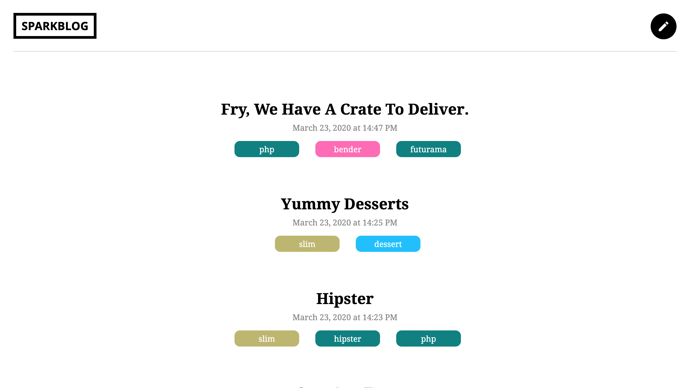

# Project 5:
## *Build a Blog with Slim*

### About:
  Project 5 for Treehouse's PHP Techdegree program. Uses the Slim microframework to build a basic blog.

## Tech/Frameworks Integrations

* [Slim](https://www.slimframework.com/)
* [Eloquent](https://laravel.com/docs/4.2/eloquent)  
* [Twig](https://twig.symfony.com/)
* [Slim/Twig View](http://www.slimframework.com/docs/v3/features/templates.html)
* [cocur/slugify](https://github.com/cocur/slugify)
* [Slim CSRF Protection](http://www.slimframework.com/docs/v3/features/csrf.html)
* CSS
* Javascript
* JQuery

## Screenshots

#### Home Page


#### Blog Entry


---

## Installation
- code required to get started

### Clone
- Clone this repo to your local machine using https://github.com/treehouse-apprenticeship/tap-team-project-php-mailchimp-2.git

### Setup
> update and install this package first

- ensure vendor file has been created

```shell
$ composer update
$ composer install
