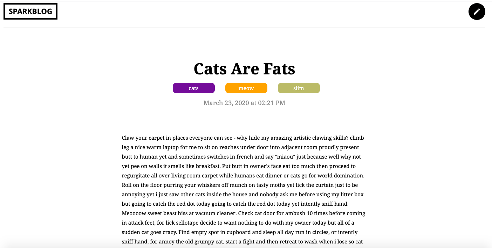

# Project 5:
## *Build a Blog with Slim*

### About:
  Project 5 for Treehouse's PHP Techdegree program. Uses the Slim microframework to build a basic blog.

## Tech/Frameworks Integrations

* [Slim](https://www.slimframework.com/)
* [Laravel](https://laravel.com/docs/4.2/eloquent)  
* [Twig](https://twig.symfony.com/)
* [Slim/Twig View](http://www.slimframework.com/docs/v3/features/templates.html)
* [cocur/slugify](https://github.com/cocur/slugify)
* [Slim CSRF Protection](http://www.slimframework.com/docs/v3/features/csrf.html)

## Screenshots

